**[Benchmark Suite for Clustering Algorithms -- Version 1](https://github.com/gagolews/clustering_benchmarks_v1)
is maintained by [Marek Gagolewski](http://www.gagolewski.com)**

--------------------------------------------------------------------------------

**Datasets**

* [graves/dense](#graves_dense)
* [graves/fuzzyx](#graves_fuzzyx)
* [graves/line](#graves_line)
* [graves/parabolic](#graves_parabolic)
* [graves/ring](#graves_ring)
* [graves/ring_noisy](#graves_ring_noisy)
* [graves/ring_outliers](#graves_ring_outliers)
* [graves/zigzag](#graves_zigzag)
* [graves/zigzag_noisy](#graves_zigzag_noisy)
* [graves/zigzag_outliers](#graves_zigzag_outliers)

--------------------------------------------------------------------------------

## graves/dense (n=200, d=2) 

    Source: Daniel Graves, Witold Pedrycz, Kernel-based fuzzy clustering
    and fuzzy clustering: A comparative experimental study,
    Fuzzy Sets and Systems 161(4), 2010, 522-543
    
    One of the "synthetic data sets" from the above-mentioned paper.
    
    Labels generated by A. Cena and M. Gagolewski.
    `0` denotes the noise class (if present).
    

#### `labels0`

true_k= 2, noise=    0, true_g=0.000

label_counts=[100, 100]

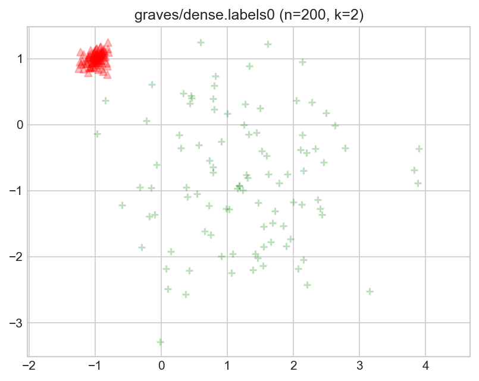

## graves/fuzzyx (n=1000, d=2) 

    Source: Daniel Graves, Witold Pedrycz, Kernel-based fuzzy clustering
    and fuzzy clustering: A comparative experimental study,
    Fuzzy Sets and Systems 161(4), 2010, 522-543
    
    One of the "synthetic data sets" from the above-mentioned paper.
    
    Labels generated by A. Cena and M. Gagolewski.
    `0` denotes the noise class (if present).
    

#### `labels0`

true_k= 5, noise=    0, true_g=0.062

label_counts=[217, 212, 210, 200, 161]

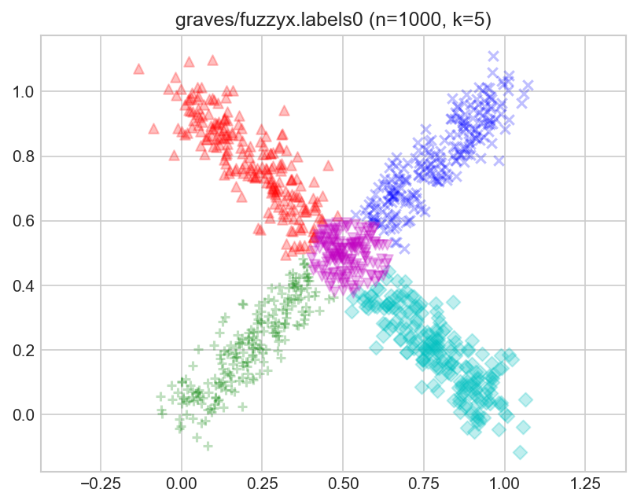

#### `labels1`

true_k= 2, noise=    0, true_g=0.172

label_counts=[586, 414]

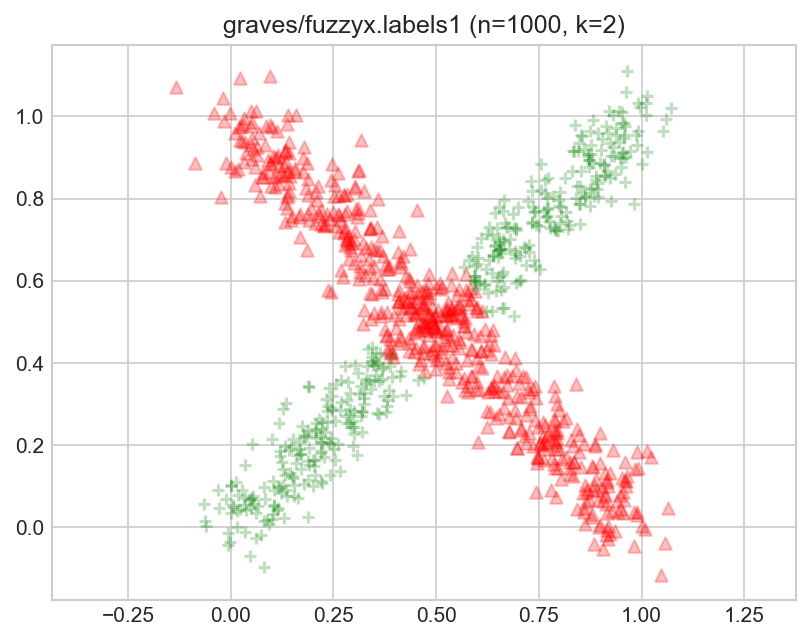

#### `labels2`

true_k= 2, noise=    0, true_g=0.000

label_counts=[500, 500]

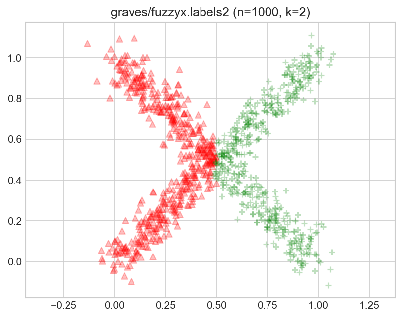

#### `labels3`

true_k= 2, noise=    0, true_g=0.116

label_counts=[558, 442]

#### `labels4`

true_k= 2, noise=    0, true_g=0.000

label_counts=[500, 500]

#### `labels5`

true_k= 4, noise=    0, true_g=0.105

label_counts=[314, 245, 226, 215]

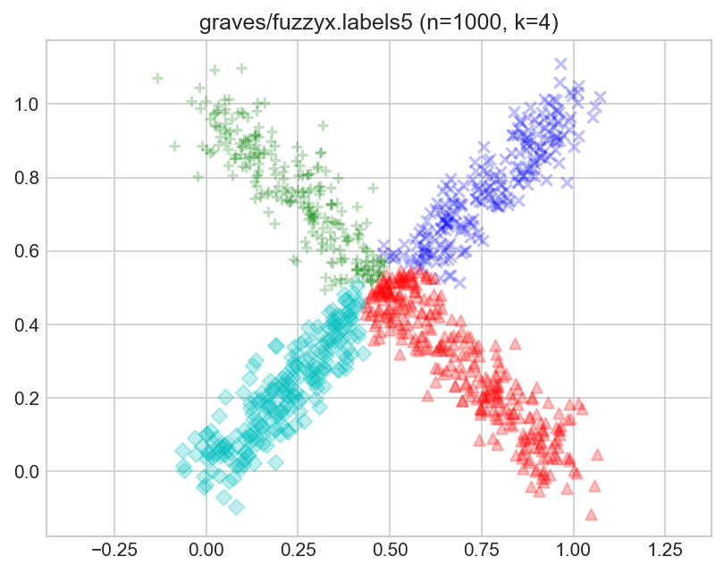

## graves/line (n=250, d=2) 

    Source: Daniel Graves, Witold Pedrycz, Kernel-based fuzzy clustering
    and fuzzy clustering: A comparative experimental study,
    Fuzzy Sets and Systems 161(4), 2010, 522-543
    
    One of the "synthetic data sets" from the above-mentioned paper.
    
    Labels generated by A. Cena and M. Gagolewski.
    `0` denotes the noise class (if present).
    

#### `labels0`

true_k= 2, noise=    0, true_g=0.600

label_counts=[200, 50]

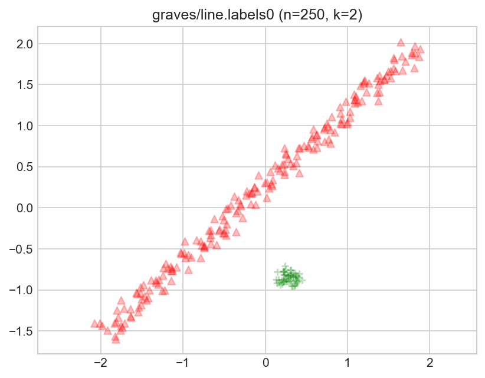

## graves/parabolic (n=1000, d=2) 

    Source: Daniel Graves, Witold Pedrycz, Kernel-based fuzzy clustering
    and fuzzy clustering: A comparative experimental study,
    Fuzzy Sets and Systems 161(4), 2010, 522-543
    
    One of the "synthetic data sets" from the above-mentioned paper.
    
    Labels generated by A. Cena and M. Gagolewski.
    `0` denotes the noise class (if present).
    

#### `labels0`

true_k= 2, noise=    0, true_g=0.016

label_counts=[508, 492]

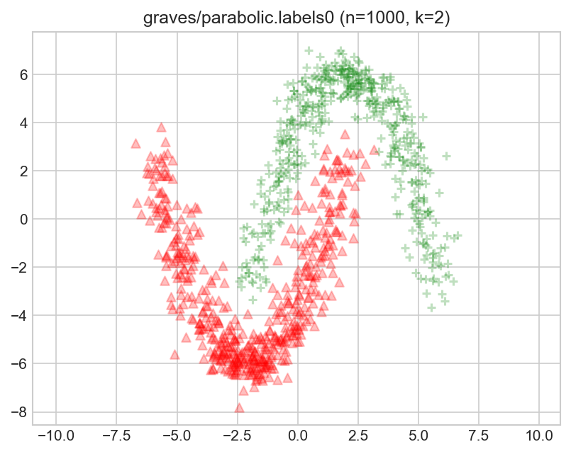

#### `labels1`

true_k= 4, noise=    0, true_g=0.152

label_counts=[320, 277, 214, 189]

## graves/ring (n=1000, d=2) 

    Source: Daniel Graves, Witold Pedrycz, Kernel-based fuzzy clustering
    and fuzzy clustering: A comparative experimental study,
    Fuzzy Sets and Systems 161(4), 2010, 522-543
    
    One of the "synthetic data sets" from the above-mentioned paper.
    
    Labels generated by A. Cena and M. Gagolewski.
    `0` denotes the noise class (if present).
    

#### `labels0`

true_k= 2, noise=    0, true_g=0.000

label_counts=[500, 500]

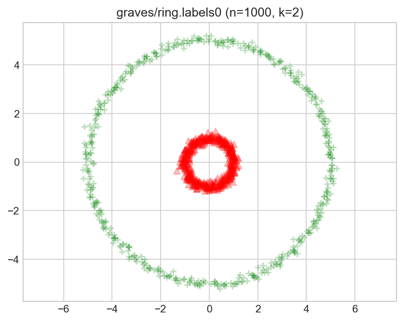

## graves/ring_noisy (n=1050, d=2) 

    Source: Daniel Graves, Witold Pedrycz, Kernel-based fuzzy clustering
    and fuzzy clustering: A comparative experimental study,
    Fuzzy Sets and Systems 161(4), 2010, 522-543
    
    One of the "synthetic data sets" from the above-mentioned paper.
    
    Labels generated by A. Cena and M. Gagolewski.
    `0` denotes the noise class (if present).
    

#### `labels0`

true_k= 2, noise=   43, true_g=0.003

label_counts=[505, 502]

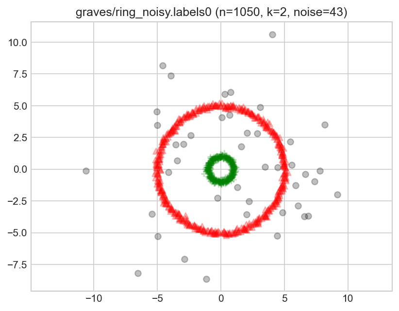

## graves/ring_outliers (n=1030, d=2) 

    Source: Daniel Graves, Witold Pedrycz, Kernel-based fuzzy clustering
    and fuzzy clustering: A comparative experimental study,
    Fuzzy Sets and Systems 161(4), 2010, 522-543
    
    One of the "synthetic data sets" from the above-mentioned paper.
    
    Labels generated by A. Cena and M. Gagolewski.
    `0` denotes the noise class (if present).
    

#### `labels0`

true_k= 5, noise=    0, true_g=0.714

label_counts=[500, 500, 10, 10, 10]

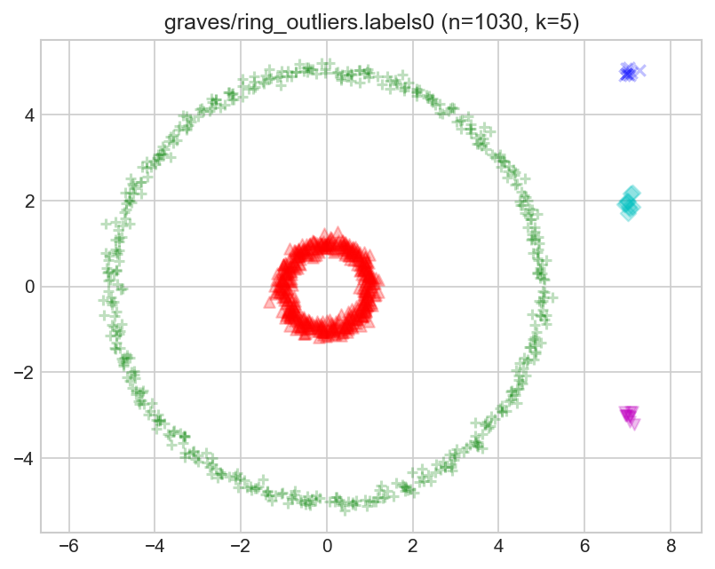

#### `labels1`

true_k= 2, noise=   30, true_g=0.000

label_counts=[500, 500]

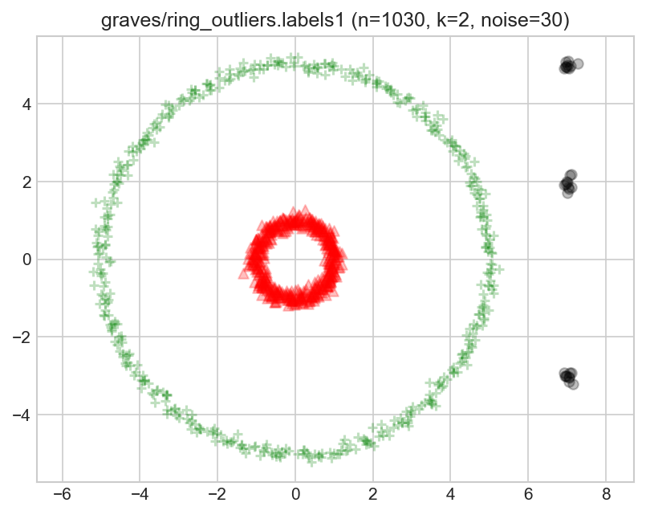

## graves/zigzag (n=250, d=2) 

    Source: Daniel Graves, Witold Pedrycz, Kernel-based fuzzy clustering
    and fuzzy clustering: A comparative experimental study,
    Fuzzy Sets and Systems 161(4), 2010, 522-543
    
    One of the "synthetic data sets" from the above-mentioned paper.
    
    Labels generated by A. Cena and M. Gagolewski.
    `0` denotes the noise class (if present).
    

#### `labels0`

true_k= 3, noise=    0, true_g=0.400

label_counts=[150, 50, 50]

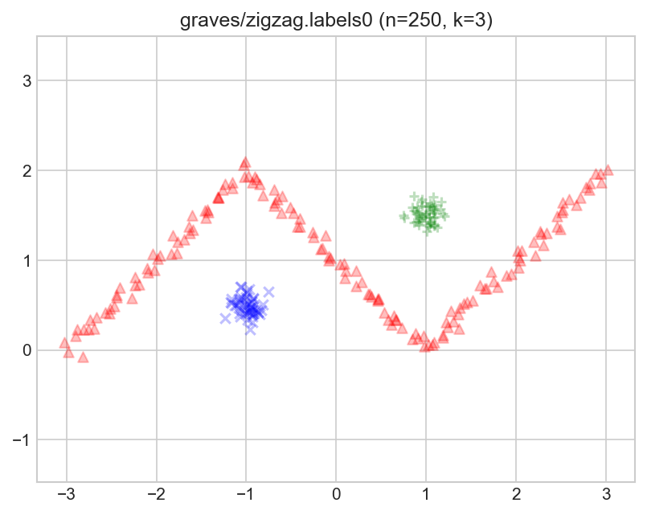

#### `labels1`

true_k= 5, noise=    0, true_g=0.042

label_counts=[56, 50, 50, 47, 47]

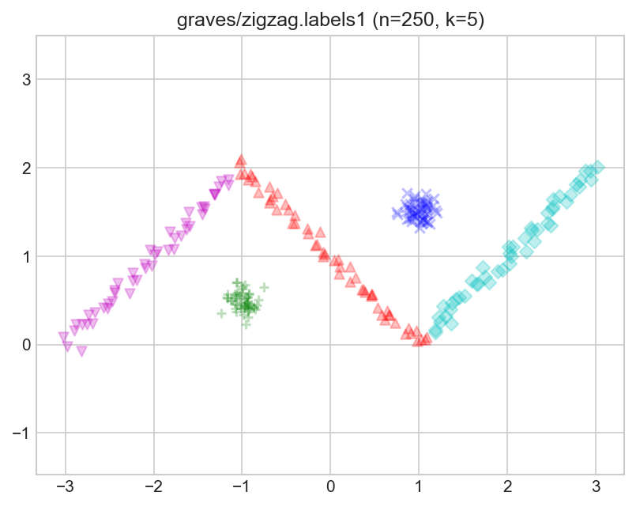

## graves/zigzag_noisy (n=300, d=2) 

    Source: Daniel Graves, Witold Pedrycz, Kernel-based fuzzy clustering
    and fuzzy clustering: A comparative experimental study,
    Fuzzy Sets and Systems 161(4), 2010, 522-543
    
    One of the "synthetic data sets" from the above-mentioned paper.
    
    Labels generated by A. Cena and M. Gagolewski.
    `0` denotes the noise class (if present).
    

#### `labels0`

true_k= 3, noise=   38, true_g=0.412

label_counts=[159, 52, 51]

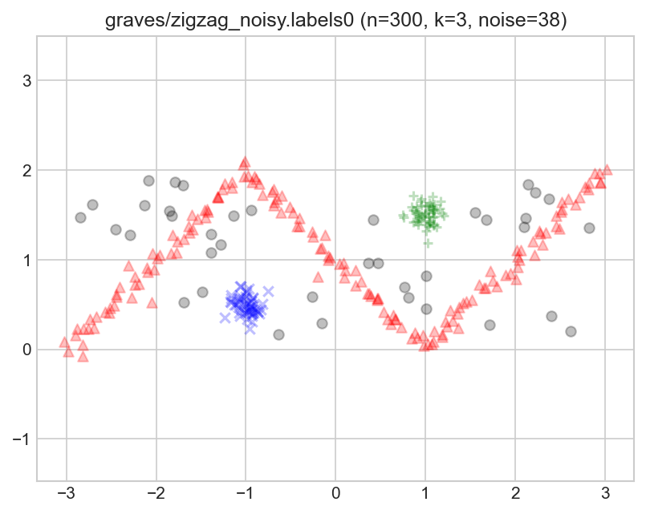

#### `labels1`

true_k= 5, noise=   38, true_g=0.013

label_counts=[54, 53, 52, 52, 51]

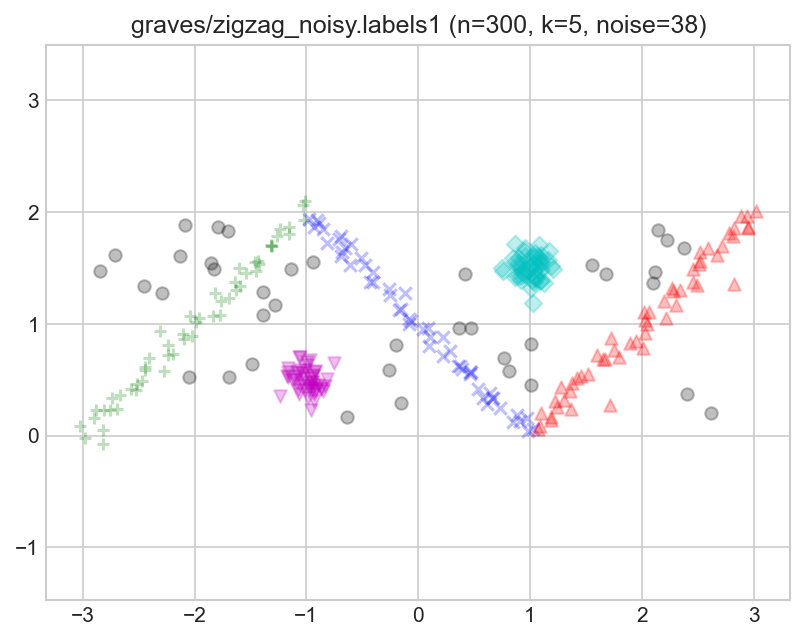

## graves/zigzag_outliers (n=280, d=2) 

    Source: Daniel Graves, Witold Pedrycz, Kernel-based fuzzy clustering
    and fuzzy clustering: A comparative experimental study,
    Fuzzy Sets and Systems 161(4), 2010, 522-543
    
    One of the "synthetic data sets" from the above-mentioned paper.
    
    Labels generated by A. Cena and M. Gagolewski.
    `0` denotes the noise class (if present).
    

#### `labels0`

true_k= 3, noise=   30, true_g=0.400

label_counts=[150, 50, 50]

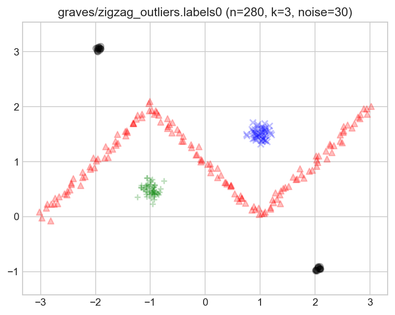

#### `labels1`

true_k= 5, noise=   30, true_g=0.042

label_counts=[56, 50, 50, 47, 47]

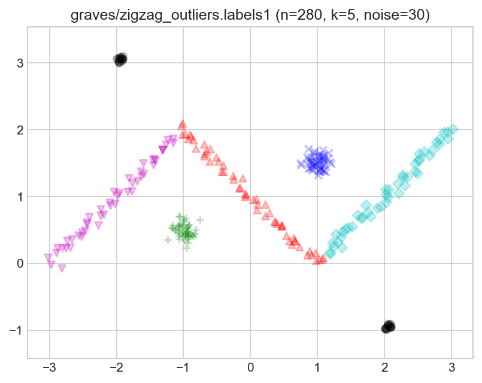

